# NOVA CRM — Task Workflow Reference

Complete documentation of the NOVA CRM pipeline, task system, automation engine, and classification logic.

---

## Table of Contents

1. [Pipeline Overview](#1-pipeline-overview)
2. [Task Flow Diagrams](#2-task-flow-diagrams)
3. [Cross-Stage Dependencies](#3-cross-stage-dependencies)
4. [Automation Rules](#4-automation-rules)
5. [Disposition Flow](#5-disposition-flow)
6. [Funding Workflow](#6-funding-workflow)
7. [AHJ-Conditional Requirements](#7-ahj-conditional-requirements)
8. [Command Center Classification](#8-command-center-classification)
9. [Queue Section Logic](#9-queue-section-logic)
10. [Task Statuses and Reasons](#10-task-statuses-and-reasons)

---

## 1. Pipeline Overview

Projects move through 7 stages in order. Each stage has required and optional tasks. A stage auto-advances when all required tasks are marked Complete.


### Stage Summary

| Stage       | Display Name   | Required Tasks | Optional Tasks | SLA Target* | SLA Risk* | SLA Critical* |
|-------------|----------------|:--------------:|:--------------:|:-----------:|:---------:|:-------------:|
| evaluation  | Evaluation     | 5              | 0              | 3 days      | 4 days    | 6 days        |
| survey      | Site Survey    | 2              | 0              | 3 days      | 5 days    | 10 days       |
| design      | Design         | 5              | 7              | 3 days      | 5 days    | 10 days       |
| permit      | Permitting     | 5              | 1              | 21 days     | 30 days   | 45 days       |
| install     | Installation   | 3              | 1              | 5 days      | 7 days    | 10 days       |
| inspection  | Inspection     | 5              | 3              | 14 days     | 21 days   | 30 days       |
| complete    | Complete       | 2              | 0              | 3 days      | 5 days    | 7 days        |

\* SLA thresholds are currently paused (set to 999) pending funding. Original values shown above.

---

## 2. Task Flow Diagrams

### Evaluation Stage

All 5 tasks are independent (no prerequisites). They can be worked in any order.

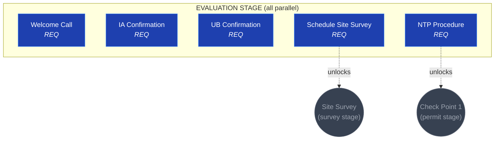

### Survey Stage

Linear chain. Site Survey requires Schedule Site Survey (from evaluation).

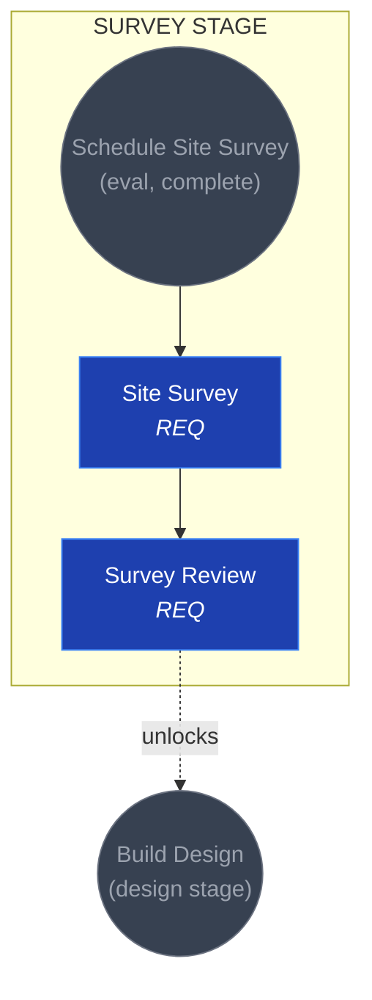

### Design Stage

The most complex stage. Scope of Work is the main branching point.

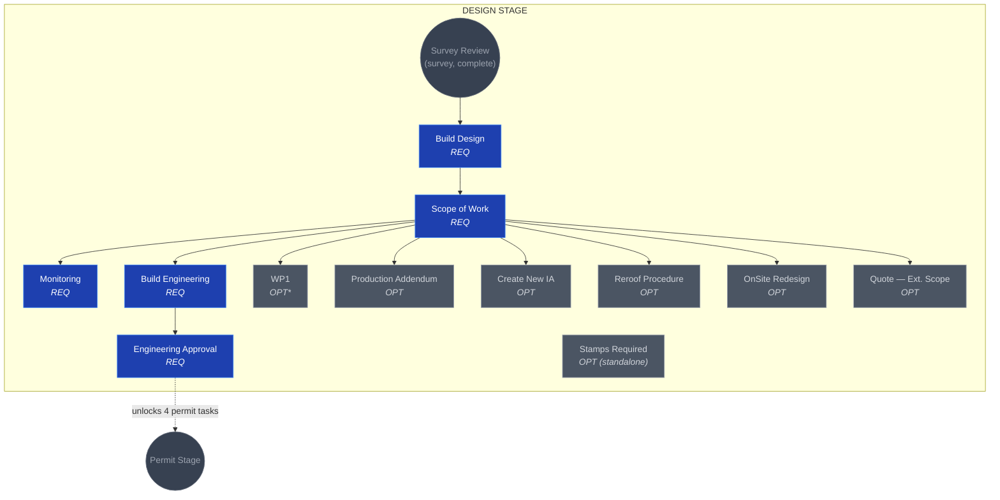

\* WP1 is required for Corpus Christi and Texas City AHJs.

### Permit Stage

Four tasks branch from Engineering Approval. Check Point 1 is a convergence gate.

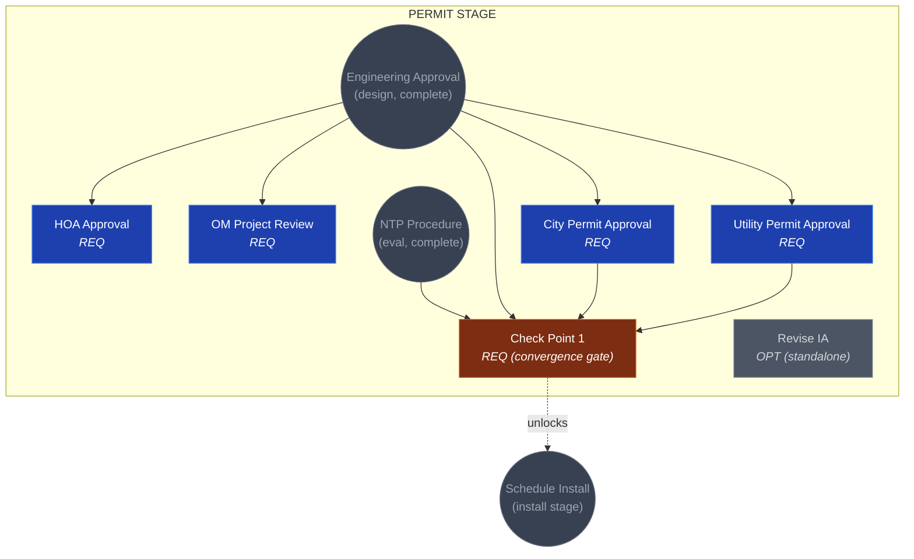

Check Point 1 prerequisites (all 4 must be Complete):
- Engineering Approval (from design stage)
- City Permit Approval
- Utility Permit Approval
- NTP Procedure (from evaluation stage)

### Install Stage

Linear after Check Point 1, with one optional standalone task.

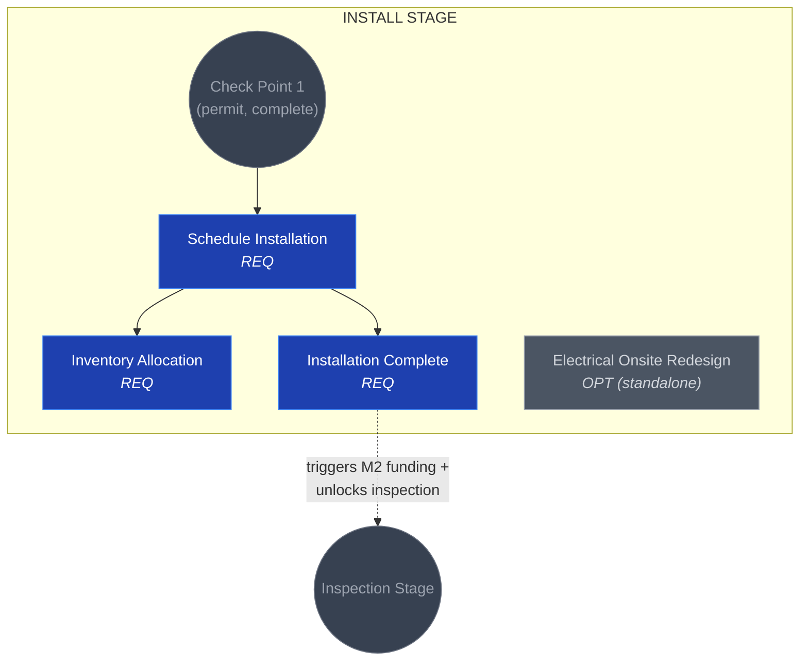

### Inspection Stage

Two parallel tracks (city and utility) converge from Inspection Review.

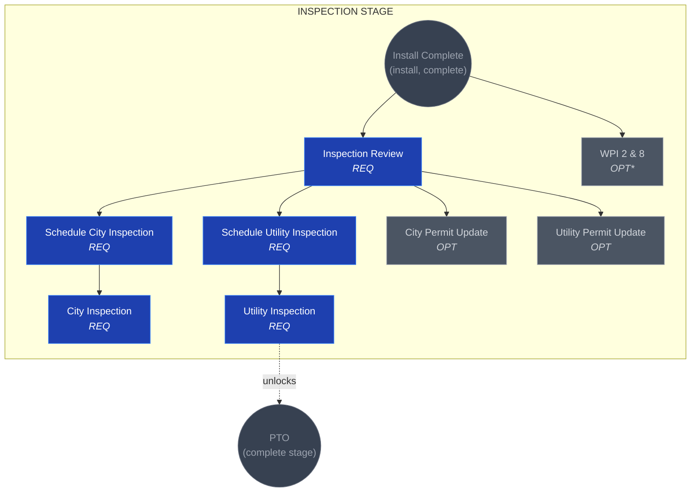

\* WPI 2 & 8 is required for Corpus Christi and Texas City AHJs.

### Complete Stage

Linear chain. Final two tasks close out the project.

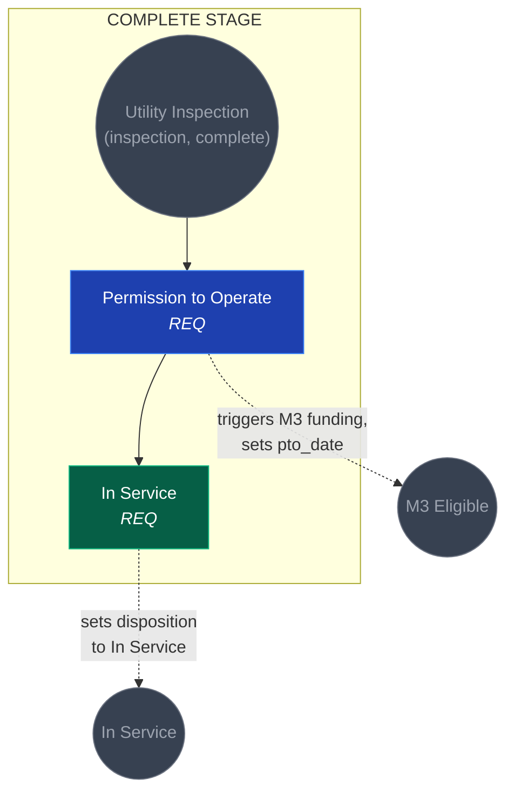

---

## 3. Cross-Stage Dependencies

Tasks can depend on tasks from earlier stages. These cross-stage prerequisite links are:

```mermaid
flowchart LR
    subgraph EVAL["Evaluation"]
        sched_survey_e["Schedule Site Survey"]
        ntp_e["NTP Procedure"]
    end

    subgraph SURV["Survey"]
        site_survey_s["Site Survey"]
        survey_review_s["Survey Review"]
    end

    subgraph DES["Design"]
        build_design_d["Build Design"]
        scope_d["Scope of Work"]
        build_eng_d["Build Engineering"]
        eng_approval_d["Engineering Approval"]
    end

    subgraph PERM["Permit"]
        hoa_p["HOA Approval"]
        om_p["OM Project Review"]
        city_p["City Permit"]
        util_p["Utility Permit"]
        cp1_p["Check Point 1"]
    end

    subgraph INST["Install"]
        sched_inst_i["Schedule Install"]
        install_done_i["Install Complete"]
    end

    subgraph INSP["Inspection"]
        insp_review_n["Inspection Review"]
        sched_city_n["Sched City Insp"]
        sched_util_n["Sched Util Insp"]
        city_insp_n["City Inspection"]
        util_insp_n["Utility Inspection"]
        wpi28_n["WPI 2 & 8"]
    end

    subgraph COMP["Complete"]
        pto_c["PTO"]
        in_service_c["In Service"]
    end

    sched_survey_e --> site_survey_s --> survey_review_s --> build_design_d
    build_design_d --> scope_d --> build_eng_d --> eng_approval_d

    eng_approval_d --> hoa_p
    eng_approval_d --> om_p
    eng_approval_d --> city_p
    eng_approval_d --> util_p
    eng_approval_d --> cp1_p
    city_p --> cp1_p
    util_p --> cp1_p
    ntp_e --> cp1_p

    cp1_p --> sched_inst_i
    sched_inst_i --> install_done_i

    install_done_i --> insp_review_n
    install_done_i --> wpi28_n
    insp_review_n --> sched_city_n --> city_insp_n
    insp_review_n --> sched_util_n --> util_insp_n

    util_insp_n --> pto_c --> in_service_c
```

### Full End-to-End Critical Path

The longest prerequisite chain through the entire pipeline:

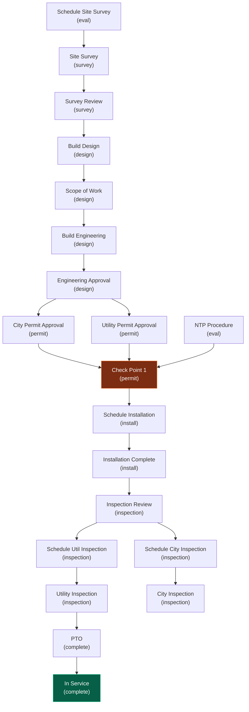

---

## 4. Automation Rules

When a task status changes, the following automations fire in the ProjectPanel component.

### Automation Chain

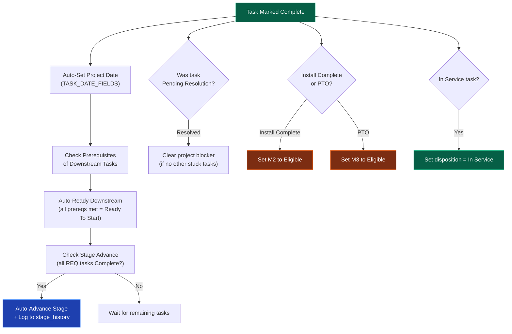

### Revision Cascade

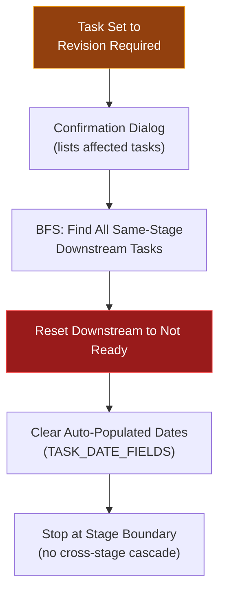

### 4.1 Auto-Populate Project Dates (TASK_DATE_FIELDS)

When a task is marked **Complete**, the corresponding project date field is automatically set to today's date.

| Task ID         | Task Name                | Project Date Field Set       |
|-----------------|--------------------------|------------------------------|
| `ntp`           | NTP Procedure            | `ntp_date`                   |
| `sched_survey`  | Schedule Site Survey     | `survey_scheduled_date`      |
| `site_survey`   | Site Survey              | `survey_date`                |
| `city_permit`   | City Permit Approval     | `city_permit_date`           |
| `util_permit`   | Utility Permit Approval  | `utility_permit_date`        |
| `sched_install` | Schedule Installation    | `install_scheduled_date`     |
| `install_done`  | Installation Complete    | `install_complete_date`      |
| `city_insp`     | City Inspection          | `city_inspection_date`       |
| `util_insp`     | Utility Inspection       | `utility_inspection_date`    |
| `pto`           | Permission to Operate    | `pto_date`                   |
| `in_service`    | In Service               | `in_service_date`            |

### 4.2 Auto-Advance Stage

When the **last required task** in a stage is marked Complete, the project automatically advances to the next pipeline stage. The transition is logged to the `stage_history` table.

Stage advancement order:
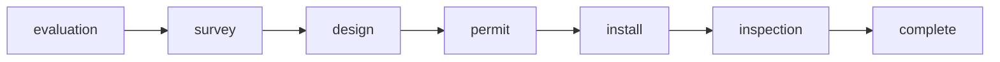

Only **required** tasks count toward stage advancement. Optional tasks do not block stage progression.

### 4.3 Auto-Detect Blockers

- When any task enters **Pending Resolution**, the project's `blocker` field is auto-set to the task's `reason` (prefixed with a pause icon).
- When that stuck task is resolved (status changes away from Pending Resolution), the blocker is auto-cleared — but **only if no other tasks remain stuck** on that project.
- A project with a non-null `blocker` field appears in the Blocked section across the CRM.

### 4.4 Funding Milestone Triggers

| Task Completion          | Funding Action                                            |
|--------------------------|-----------------------------------------------------------|
| Installation Complete    | Sets M2 milestone to **Eligible**. Creates funding record if none exists. |
| Permission to Operate    | Sets M3 milestone to **Eligible**. Creates funding record if none exists. |

### 4.5 Task Duration Tracking

- When a task moves to **In Progress**, `started_date` is automatically set on the task_state record.
- When a task moves to **Complete**, duration is calculated from `started_date` to completion.

### 4.6 Revision Cascade

When a task is set to **Revision Required**:

1. A confirmation dialog is shown listing all downstream tasks that will be reset.
2. All **same-stage downstream tasks** (found via BFS through the prerequisite chain) are reset to **Not Ready**.
3. Corresponding auto-populated dates (from TASK_DATE_FIELDS) are **cleared** for all cascaded tasks.
4. The cascade is limited to the same stage — it does not cross stage boundaries.

Example: Setting `build_design` to Revision Required in the design stage cascades to:

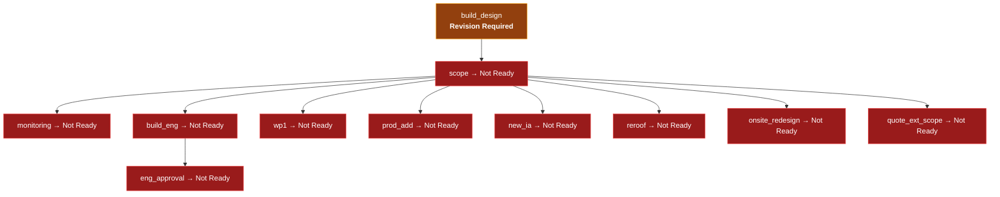

### 4.7 Auto-Set In Service Disposition

When the **In Service** task is marked Complete, the project's `disposition` field is automatically set to `'In Service'`.

### 4.8 Prerequisite Unlocking

When a task is marked Complete, all tasks that list it as a prerequisite become eligible for **Ready To Start** status (provided all of their other prerequisites are also Complete).

---

## 5. Disposition Flow

Projects have a `disposition` field that controls their visibility and classification across the CRM.

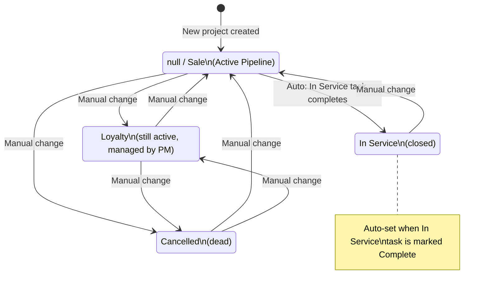

### Disposition Visibility by Page

| Page       | null/Sale | Loyalty   | In Service | Cancelled |
|------------|:---------:|:---------:|:----------:|:---------:|
| Command    | Active    | Separate section | Separate section | Hidden |
| Pipeline   | Shown     | Hidden    | Hidden     | Hidden    |
| Queue      | Shown     | Separate section | Hidden | Hidden |
| Analytics  | Shown     | Hidden    | Hidden     | Hidden    |
| Funding    | Shown     | Hidden    | Hidden     | Hidden    |
| Audit      | Shown     | Shown     | Hidden     | Hidden    |

Key: Loyalty projects appear in Queue and Audit because PMs still actively manage them.

---

## 6. Funding Workflow

Each project can have up to 3 funding milestones (M1, M2, M3) tracked in the `project_funding` table.

### Milestone Flow

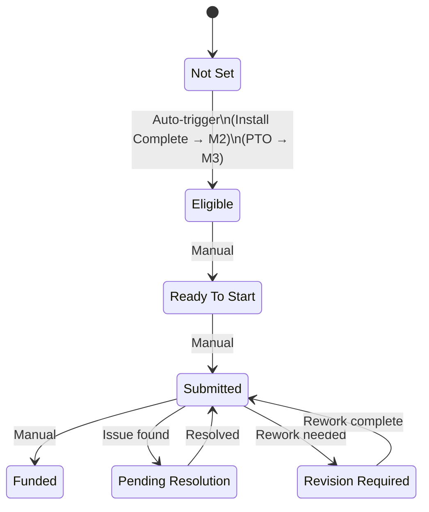

### Automatic Milestone Triggers

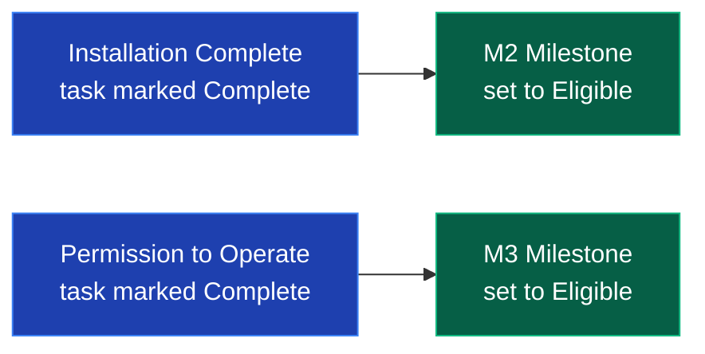

M1 is not auto-triggered — it is managed manually.

### Funding Record Fields

Each milestone record includes:
- Milestone amount
- Milestone date (when funded)
- CB (clawback) credit amount
- Status tracking

---

## 7. AHJ-Conditional Requirements

Some tasks are normally optional but become **required** when the project's AHJ (Authority Having Jurisdiction) matches specific cities.

| Task ID  | Task Name  | Normally | Required When AHJ Is             |
|----------|------------|:--------:|----------------------------------|
| `wp1`    | WP1        | Optional | **Corpus Christi** or **Texas City** |
| `wpi28`  | WPI 2 & 8  | Optional | **Corpus Christi** or **Texas City** |

### How It Works

The `isTaskRequired()` function checks:
1. If the task is already marked `req: true`, it is always required.
2. If the task ID appears in `AHJ_REQUIRED_TASKS`, the project's AHJ is matched (case-insensitive, prefix match).
3. When a task becomes conditionally required, it blocks stage advancement just like any other required task.

### Impact on Stage Advancement

- **Design stage**: If AHJ is Corpus Christi or Texas City, WP1 must be Complete (along with all other required tasks) before the stage advances.
- **Inspection stage**: If AHJ is Corpus Christi or Texas City, WPI 2 & 8 must be Complete before the stage advances.

---

## 8. Command Center Classification

The Command Center (`/command`) classifies projects into sections using this priority-ordered logic. A project appears in the **first** matching section only (except Aging, which can overlap).

### Classification Priority Order

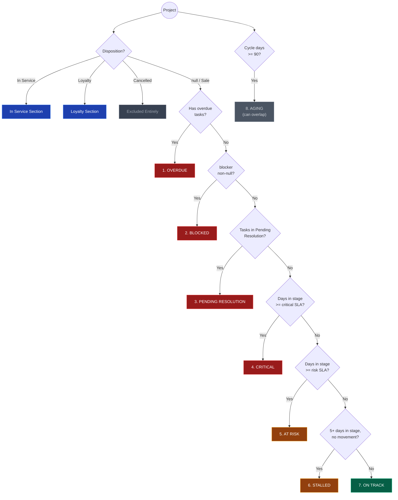

### SLA Calculation

```
Days in stage = daysAgo(project.stage_date)

If days >= crit threshold  -->  "crit"
If days >= risk threshold  -->  "risk"
Otherwise                  -->  "ok"
```

### Helper Functions

- `cycleDays(p)` = `daysAgo(p.sale_date) || daysAgo(p.stage_date)` — total project age
- `isBlocked(p)` = `!!p.blocker`
- `isStalled(p)` = not blocked AND `daysAgo(p.stage_date) >= 5`

---

## 9. Queue Section Logic

The Queue page (`/queue`) shows a PM-filtered project list organized into task-based sections.

### Exclusions

- **In Service** and **Cancelled** dispositions are excluded entirely.
- **Loyalty** projects get their own separate collapsible section.

### Section Classification

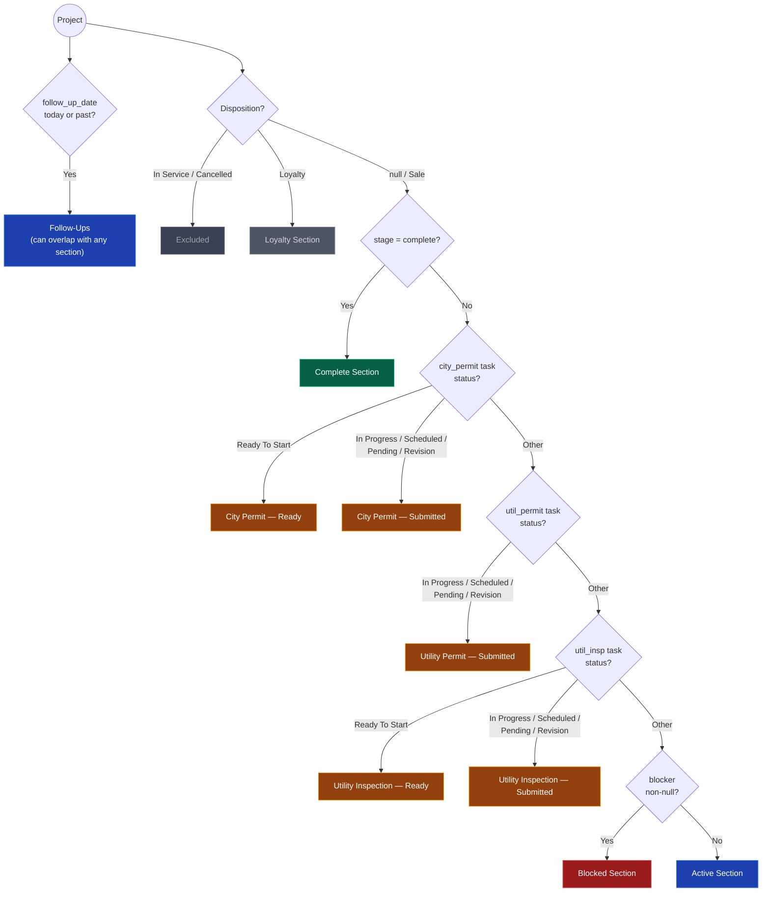

### Section Definitions

| Section                     | Filter Logic                                                     |
|-----------------------------|------------------------------------------------------------------|
| **Follow-Ups**              | Project or task `follow_up_date` is today or overdue (past).     |
| **City Permit — Ready**     | `city_permit` task status = `Ready To Start`, not complete stage. |
| **City Permit — Submitted** | `city_permit` task status is In Progress, Scheduled, Pending Resolution, or Revision Required. Not complete stage. |
| **Utility Permit — Submitted** | `util_permit` task status is In Progress, Scheduled, Pending Resolution, or Revision Required. Not complete stage. |
| **Utility Inspection — Ready** | `util_insp` task status = `Ready To Start`, not complete stage. |
| **Utility Inspection — Submitted** | `util_insp` task status is In Progress, Scheduled, Pending Resolution, or Revision Required. Not complete stage. |
| **Blocked**                 | Project has a non-null `blocker` field.                          |
| **Active**                  | Everything not in any special section above, and not complete.   |
| **Loyalty**                 | `disposition = 'Loyalty'` (separate section).                    |
| **Complete**                | `stage = 'complete'`.                                            |

### Section Overlap Rules

- A project **can** appear in both **Blocked** and a task-based section (e.g., City Permit Submitted + Blocked). The Blocked section does not exclude projects from task sections.
- A project in a task-based section (City Permit, Utility Permit, Utility Inspection) is **excluded** from the Active section.
- Follow-Ups is computed independently and can overlap with any section.

### Sort Priority

Projects within each section are sorted by a priority function that weights stage position and SLA status.

---

## 10. Task Statuses and Reasons

### Status Progression

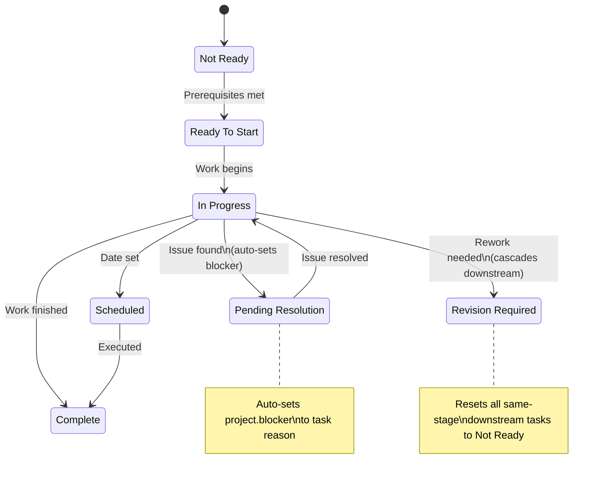

### Status Descriptions

| Status              | Meaning                                                  | UI Color    |
|---------------------|----------------------------------------------------------|-------------|
| Not Ready           | Prerequisites not met, cannot be started                 | Gray        |
| Ready To Start      | All prerequisites complete, waiting to begin             | Light gray  |
| In Progress         | Actively being worked                                    | Blue        |
| Scheduled           | Date/time set for execution                              | Indigo      |
| Pending Resolution  | Blocked by an issue requiring resolution                 | Red         |
| Revision Required   | Needs rework, cascades downstream tasks to Not Ready     | Amber       |
| Complete            | Done                                                     | Green       |

### Pending Resolution Reasons (by Task)

Each task has a curated list of Pending Resolution reasons. Selected examples:

**Evaluation tasks:**
- Welcome Call: Credit Declined, Customer Unresponsive, Pending Cancellation, etc.
- IA Confirmation: Incorrect info (email/name/phone/price), Missing Document, Not Signed
- NTP Procedure: IA Resign, Missing Utility Bill, NTP Not Granted, Pending HCO/NCCO

**Design tasks:**
- Build Design: Extended Scope of Work, MPU Review, Pending DQ, Requires Table Discussion
- Engineering Approval: Battery Review, Missing Document/Photos, Sent for Stamps

**Permit tasks:**
- City Permit: Open Permits, Pending Engineering Revision, Pending HOA Approval
- Utility Permit: Duplicate Under Review, Pending ICA/PTO, Pending Utility Reply
- Check Point 1: Contract Issues, Credit Expired, Inventory Shortages, Need Reroof

**Inspection tasks:**
- City/Utility Inspection scheduling: Install Incomplete, Pending Corrections, Pending Service

**Complete tasks:**
- PTO: Pending PTO Issuance
- In Service: Battery Issues, CT Issues, Gateway Not Reporting, System Activation Incomplete

### Revision Required Reasons (by Stage)

Each stage has a curated list of Revision Required reasons. Selected examples:

- **Evaluation**: Incorrect Customer Info, Need New IA, PPW Too High
- **Survey**: Customer Postponed, Missing Photos (attic/drone/electrical/roof)
- **Design**: AHJ Correction, Battery Addition, Panel Count/Type Change, Utility Correction
- **Permit**: City/Utility Permit Revision, Incorrect Data on Plans, Reroof Discovered
- **Install**: Customer Canceled/Reschedule, Missing Material, Weather, OSR Required
- **Inspection**: Correction Needed, Grounding issues, Install Not Matching Plans, Workmanship
- **Complete**: Need PTO Letter, Tech Required

---

## Appendix: Complete Task Reference

### All Tasks with IDs, Prerequisites, and Requirements

| Stage      | Task ID           | Task Name                   | Prerequisites                               | Req? |
|------------|-------------------|-----------------------------|---------------------------------------------|:----:|
| evaluation | `welcome`         | Welcome Call                | (none)                                      | Yes  |
| evaluation | `ia`              | IA Confirmation             | (none)                                      | Yes  |
| evaluation | `ub`              | UB Confirmation             | (none)                                      | Yes  |
| evaluation | `sched_survey`    | Schedule Site Survey        | (none)                                      | Yes  |
| evaluation | `ntp`             | NTP Procedure               | (none)                                      | Yes  |
| survey     | `site_survey`     | Site Survey                 | `sched_survey`                              | Yes  |
| survey     | `survey_review`   | Survey Review               | `site_survey`                               | Yes  |
| design     | `build_design`    | Build Design                | `survey_review`                             | Yes  |
| design     | `scope`           | Scope of Work               | `build_design`                              | Yes  |
| design     | `monitoring`      | Monitoring                  | `scope`                                     | Yes  |
| design     | `build_eng`       | Build Engineering           | `scope`                                     | Yes  |
| design     | `eng_approval`    | Engineering Approval        | `build_eng`                                 | Yes  |
| design     | `stamps`          | Stamps Required             | (none)                                      | No   |
| design     | `wp1`             | WP1                         | `scope`                                     | No*  |
| design     | `prod_add`        | Production Addendum         | `scope`                                     | No   |
| design     | `new_ia`          | Create New IA               | `scope`                                     | No   |
| design     | `reroof`          | Reroof Procedure            | `scope`                                     | No   |
| design     | `onsite_redesign` | OnSite Redesign             | `scope`                                     | No   |
| design     | `quote_ext_scope` | Quote — Extended Scope      | `scope`                                     | No   |
| permit     | `hoa`             | HOA Approval                | `eng_approval`                              | Yes  |
| permit     | `om_review`       | OM Project Review           | `eng_approval`                              | Yes  |
| permit     | `city_permit`     | City Permit Approval        | `eng_approval`                              | Yes  |
| permit     | `util_permit`     | Utility Permit Approval     | `eng_approval`                              | Yes  |
| permit     | `checkpoint1`     | Check Point 1               | `eng_approval`, `city_permit`, `util_permit`, `ntp` | Yes  |
| permit     | `revise_ia`       | Revise IA                   | (none)                                      | No   |
| install    | `sched_install`   | Schedule Installation       | `checkpoint1`                               | Yes  |
| install    | `inventory`       | Inventory Allocation        | `sched_install`                             | Yes  |
| install    | `install_done`    | Installation Complete       | `sched_install`                             | Yes  |
| install    | `elec_redesign`   | Electrical Onsite Redesign  | (none)                                      | No   |
| inspection | `insp_review`     | Inspection Review           | `install_done`                              | Yes  |
| inspection | `sched_city`      | Schedule City Inspection    | `insp_review`                               | Yes  |
| inspection | `sched_util`      | Schedule Utility Inspection | `insp_review`                               | Yes  |
| inspection | `city_insp`       | City Inspection             | `sched_city`                                | Yes  |
| inspection | `util_insp`       | Utility Inspection          | `sched_util`                                | Yes  |
| inspection | `city_upd`        | City Permit Update          | `insp_review`                               | No   |
| inspection | `util_upd`        | Utility Permit Update       | `insp_review`                               | No   |
| inspection | `wpi28`           | WPI 2 & 8                   | `install_done`                              | No*  |
| complete   | `pto`             | Permission to Operate       | `util_insp`                                 | Yes  |
| complete   | `in_service`      | In Service                  | `pto`                                       | Yes  |

\* Required for Corpus Christi and Texas City AHJs.

---

*Generated for the NOVA CRM team. Source of truth: `lib/tasks.ts`, `lib/utils.ts`, `app/command/page.tsx`, `app/queue/page.tsx`.*
